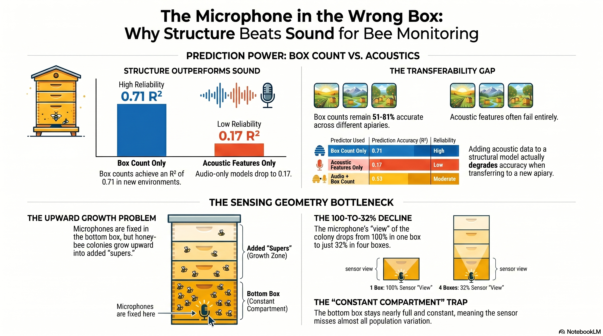

<p align="center">
  
</p>

# bee-sound — Structure over sound

> **A free, management-known box count out-predicts _and_ out-transfers a 20-feature in-hive microphone
> model for honey-bee colony strength.**

Reproduction code for **J. Degenfellner & M. Templ**, *Structure over sound: a free box
count out-predicts in-hive acoustics for honey-bee colony strength* (manuscript; target venue
*Computers and Electronics in Agriculture*).

In-hive microphones are widely promoted for non-invasive estimation of colony strength — the number of
**frames of bees (FoB)** — with benchmarks reporting near-perfect accuracy. Re-analysing two open
multi-sensor honey-bee datasets under honest, **colony-grouped and cross-apiary** validation, we show
that this accuracy is largely a **structural confound** rather than acoustic skill: the **number of
boxes**, which the beekeeper already knows without opening the hive, predicts colony size far better than
audio. The reason is physical — the single sensor sits in the near-constant bottom brood box while the
colony grows upward into the supers it cannot hear.

**Headline numbers (leave-one-apiary-out, MSPB):**

- Box count alone: *R²* ≈ **0.71**; audio alone: *R²* ≈ **0.17** — and adding audio to box count does not help.
- Box count **transfers** across datasets (cross-dataset *R²* 0.81 and 0.51); the acoustic features do **not**.
- Even the uncertainty fails to travel: split-conformal intervals near their nominal **90 %** coverage
  within an apiary fall to **67 %** in one transfer direction and inflate to **98 %** in the other.

We argue for **structure-first, uncertainty-honest** colony-strength models, validated across apiaries
rather than within them.

This repository contains **only code and the figure above**. The two datasets are **not
redistributed** — we are not their owners (see [Data](#data-download-separately-not-included)). Analysis
outputs (figures, `.rds`, summary `.csv`) are regenerated by the scripts and are gitignored.

## Layout

```
analysis/    R pipeline, 01–11 (run with Rscript; outputs land in analysis/output/, gitignored)
assets/      the figure shown above
mspb/        MSPB dataset    (gitignored — download separately, see Data)
urban/UrBAN/ UrBAN dataset   (gitignored — upstream repo clone + FRDR data, see Data)
```

## Software

R ≥ 4.5 with: `tidyverse`, `lubridate`, `data.table`, `readxl`, `here`, `lme4`, `robustlmm`, `ranger`,
and (for the UrBAN audio extraction, script 06) `tuneR`, `signal`. Install with:

```r
install.packages(c("tidyverse","lubridate","data.table","readxl","here",
                   "lme4","robustlmm","ranger","tuneR","signal"))
```

Paths are resolved with `here::here()` from the repository root (the `.git` directory marks the root), so
**run the scripts from the repository root** — e.g. `Rscript analysis/03_mspb_modeling.R`. All scripts set
`set.seed(1)` and every `ranger()` call passes `seed = 1`, so results are reproducible.

## Data (download separately; not included)

Both datasets are gitignored and must be placed in the locations below before running. We re-derive all
modelling tables from the source files; we do **not** redistribute the data.

**MSPB** — Zhu et al. 2024, *Scientific Data* 11:860. Zenodo, doi:10.5281/zenodo.8371700, **CC-BY-NC 4.0**
(non-commercial). Place under `mspb/`:

| File | Used by |
|---|---|
| `D1_ant.xlsx`, `D2_ant.xlsx` | 02 (per-evaluation population: per-box FoB, box count) |
| `D1_sensor_data.csv`, `D2_sensor_data.csv` | 02 (20 shared acoustic features + temperature/humidity) |

**UrBAN** — Abdollahi et al. 2025. FRDR, doi:10.20383/103.0972, **CC-BY 4.0**. The repository expects a
clone of the upstream data repo at `urban/UrBAN/`. Place the FRDR records under `urban/UrBAN/data/`:

| File / directory | Used by |
|---|---|
| `annotations/inspections_2021.csv` | 01, 07, 08 (FoB labels, box count) |
| `temperature_humidity/sensor_2021.csv` | 01 (in-hive temperature/humidity) |
| `weather_info/weather_2021_2022.csv` | 01 (external weather) |
| `audio/beehives_2021/*.wav` | 06 only (16 kHz raw audio, Globus-gated; **not needed** for the MSPB results, the ICC headline or the cross-dataset transfer once the derived feature table exists) |

## Run order

Scripts write to `analysis/output/`; later scripts read earlier outputs (`mspb_harmonized.rds`,
`urban_audio_features_2021.rds`, …).

| Script | Produces |
|---|---|
| `01_build_urban_table.R` | UrBAN harmonised table + EDA |
| `02_build_mspb_table.R` | MSPB harmonisation (`mspb_harmonized.rds`); bottom-box-share figure (Fig. 3b) |
| `03_mspb_modeling.R` | CV-regime gap (Table 1), audio-only total-vs-bottom |
| `04_mspb_refinements.R` | structure horse-race (Table 3), hive-power attenuation, split-conformal (Table 5, Fig. 4) |
| `05_mspb_upperbox.R` | compartment localisation (§3.5) |
| `06_urban_extract_features.R` | UrBAN hand-crafted audio features from raw WAV (needs the FRDR audio) |
| `07_urban_modeling.R` | within-UrBAN models + cross-dataset transfer (Table 4) |
| `08_icc_recompute.R` | like-for-like ICC of FoB (UrBAN 0.54 vs MSPB 0.30) |
| `09_lmm_interpret.R` | interpretation of the hierarchical LMM (Table 2) |
| `10_lmm_diagnostics.R` | LMM assumption checks (normality, heteroscedasticity, VIF, outliers, singularity) for the Table 2 models |
| `11_review_analyses.R` | supplementary analyses (standardised Table 2 CIs, multicollinearity, best-subset audio, localisation diagnostics) |

The MSPB results (Tables 1–3, 5; §3.5) and the ICC headline are reproducible from the directly
downloadable MSPB and UrBAN inspection/sensor records. The cross-dataset transfer (Table 4) and the
within-UrBAN audio CV additionally require the Globus-gated UrBAN raw audio (run 06 first).

## License

Code in this repository is released under the **GNU GPL v3** (see [`LICENSE`](LICENSE)). The two datasets
are **not** covered by that license and are not redistributed here: **UrBAN** is CC-BY 4.0 (FRDR,
doi:10.20383/103.0972); **MSPB** is CC-BY-NC 4.0 (Zenodo, doi:10.5281/zenodo.8371700). Please cite the
original dataset papers when using the data.
