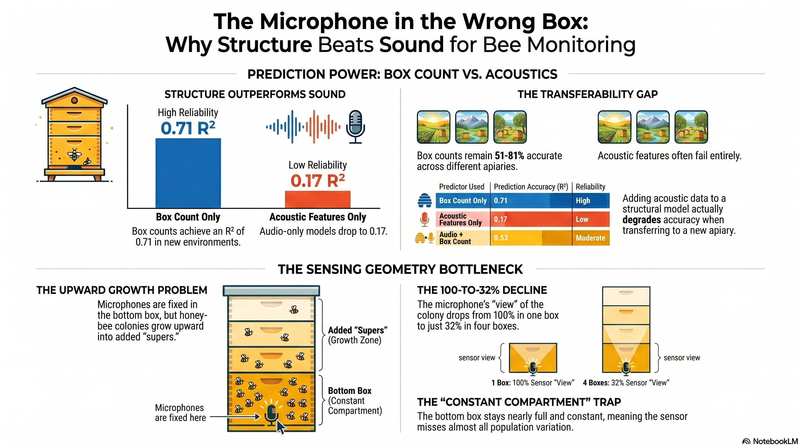

<p align="center">
  
</p>

# bee-sound — Structure over sound

> **A free, management-known box count out-predicts _and_ out-transfers a 20-feature in-hive microphone
> model for honey-bee colony strength.**

Reproduction code for **J. Degenfellner & M. Templ**, *Structure over sound: a free box
count out-predicts in-hive acoustics for honey-bee colony strength* (manuscript; target venue
*Computers and Electronics in Agriculture*).

In-hive microphones are widely promoted for non-invasive estimation of colony strength, the number of
**frames of bees (FoB)**, with benchmarks reporting near-perfect accuracy. Re-analysing two open
multi-sensor honey-bee datasets under **colony-grouped and cross-apiary** validation, we show that most
of this accuracy is not acoustic: the **number of boxes**, which the beekeeper already knows without
opening the hive, predicts colony size far better than the 20 shared acoustic features, and adding the
acoustic features to the box count and the in-hive climate never improves accuracy materially. A
plausible reason is sensing geometry: the single sensor sits in the near-constant bottom brood box while
almost all population variation is in the supers above it. That explanation is a hypothesis consistent
with the data, not a measured propagation limit.

**Headline numbers (leave-one-apiary-out, MSPB, Table 4 of the paper):**

- Box count alone: *R²* = **0.71**; in-hive temperature and humidity alone: **0.56**; the 20 acoustic
  features alone: **0.17**. Adding the acoustic block to box count and climate changes *R²* by
  −0.12 to +0.02 depending on the random-forest `mtry` rule (Table 6).
- Split-conformal intervals at nominal **90 %** coverage within an apiary: under apiary transfer the
  sensor model's cover **70 %** in one direction and **99 %** in the other, the box-count model's
  **91 %** and **89 %** (Table 9). Because calibration residuals are clustered within colonies, these
  coverages are empirical; a colony-level (hierarchical) conformal rule gives the same contrast
  (Table 10).
- In an exploratory cross-dataset comparison on a 17-assessment UrBAN sample, the box count transferred
  (*R²* 0.81 and 0.51) and the acoustic features did not (Table 8).

We argue for **structure-first** colony-strength models with transfer-aware uncertainty, validated
across apiaries and not only within them. The principal conclusion rests on the within-MSPB
leave-one-apiary-out comparison and is limited to its two apiaries, the shared acoustic features, the
single bottom-box microphone configuration and the frames-of-bees target.

This repository contains **only code, the figure above and the reference output of script 13**. The
two datasets are **not redistributed** — we are not their owners (see
[Data](#data-download-separately-not-included)). Analysis outputs (figures, `.rds`, summary `.csv`) are
regenerated by the scripts and are gitignored. The one exception is the log and summary table behind
Tables 9 and 10, kept in `analysis/reference_output/` so that a re-run can be compared against them.

## Layout

```
analysis/    R pipeline, 01–13 (run with Rscript; outputs land in analysis/output/, gitignored)
analysis/reference_output/  the numeric logs the paper's Tables 9 and 10 were read from (script 13)
assets/      the figure shown above
mspb/        MSPB dataset    (gitignored — download separately, see Data)
urban/UrBAN/ UrBAN dataset   (gitignored — upstream repo clone + FRDR data, see Data)
```

## Software

R 4.5.2 (the version used for the published results; the script 13 reference output was produced with
R 4.6.0) with: `tidyverse`, `lubridate`, `data.table`, `readxl`, `here`, `lme4`, `robustlmm`,
`ranger`, and (for the UrBAN audio extraction, script 06) `tuneR`, `signal`. Install with:

```r
install.packages(c("tidyverse","lubridate","data.table","readxl","here",
                   "lme4","robustlmm","ranger","tuneR","signal"))
```

Paths are resolved with `here::here()` from the repository root (the `.git` directory marks the root), so
**run the scripts from the repository root** — e.g. `Rscript analysis/03_mspb_modeling.R`. All scripts set
`set.seed(1)` and every `ranger()` call passes `seed = 1`, so results are reproducible.

## Data (download separately; not included)

Both datasets are gitignored and must be placed in the locations below before running. We re-derive all
modelling tables from the source files; we do **not** redistribute the data.

**MSPB** — Zhu et al. 2024, *Scientific Data* 11:860. Zenodo, doi:10.5281/zenodo.8371700, **CC-BY-NC 4.0**
(non-commercial). Place under `mspb/`:

| File | Used by |
|---|---|
| `D1_ant.xlsx`, `D2_ant.xlsx` | 02 (per-evaluation population: per-box FoB, box count) |
| `D1_sensor_data.csv`, `D2_sensor_data.csv` | 02 (20 shared acoustic features + temperature/humidity) |

**UrBAN** — Abdollahi et al. 2025. FRDR, doi:10.20383/103.0972, **CC-BY 4.0**. The repository expects a
clone of the upstream data repo at `urban/UrBAN/`. Place the FRDR records under `urban/UrBAN/data/`:

| File / directory | Used by |
|---|---|
| `annotations/inspections_2021.csv` | 01, 07, 08 (FoB labels, box count) |
| `temperature_humidity/sensor_2021.csv` | 01 (in-hive temperature/humidity) |
| `weather_info/weather_2021_2022.csv` | 01 (external weather) |
| `audio/beehives_2021/*.wav` | 06 only (16 kHz raw audio, Globus-gated; **not needed** for the MSPB results, the ICC headline or the cross-dataset transfer once the derived feature table exists) |

## Run order

Scripts write to `analysis/output/`; later scripts read earlier outputs (`mspb_harmonized.rds`,
`urban_audio_features_2021.rds`, …).

| Script | Produces |
|---|---|
| `01_build_urban_table.R` | UrBAN harmonised table + EDA |
| `02_build_mspb_table.R` | MSPB harmonisation (`mspb_harmonized.rds`); bottom-box-share figure (Fig. 4b) |
| `03_mspb_modeling.R` | CV-regime gap (Table 2), audio-only total-vs-bottom |
| `04_mspb_refinements.R` | structure comparison, hive-power attenuation (§3.3), single-model split-conformal (superseded by 12) |
| `05_mspb_upperbox.R` | compartment localisation (§3.7) |
| `06_urban_extract_features.R` | UrBAN hand-crafted audio features from raw WAV (needs the FRDR audio) |
| `07_urban_modeling.R` | within-UrBAN models + cross-dataset transfer (Table 8) |
| `08_icc_recompute.R` | like-for-like ICC of FoB (UrBAN 0.54 vs MSPB 0.30) |
| `09_lmm_interpret.R` | interpretation of the linear mixed model (Table 3) |
| `10_lmm_diagnostics.R` | LMM assumption checks (normality, heteroscedasticity, VIF, outliers, singularity) for the Table 3 models |
| `11_review_analyses.R` | supplementary analyses (standardised LMM CIs, multicollinearity, best-subset audio, localisation diagnostics) |
| `12_revision_analyses.R` | predictor-block ablation with colony-cluster bootstrap CIs (Table 4, Fig. 3), paired incremental contributions (Table 5) and their `mtry` sensitivity (Table 6), previous-visit box count (Table 7), temporal/doubly-blocked CV (§3.5), domain-shift diagnostics (§3.6), split-conformal for both models (Table 9, Fig. 5), FoB saturation (§3.7), robustness to feature count / learner / averaging window, and the bottom-vs-upper coefficient difference with a cluster-bootstrap CI (§3.7, section K) |
| `13_hierarchical_conformal.R` | conformal intervals under a **colony-level (hierarchical) rule** (Lee, Barber & Willett 2026, doi:10.1145/3786352) alongside the assessment-level rule on identical splits (Table 10). Its first block re-derives Table 9 from the same random splits as 12, so the two can be checked against each other |

Script 12 reads only the derived tables (`mspb_harmonized.rds`, `urban_matched_table.rds`,
`urban_harmonized.rds`), so it runs without re-touching the raw audio. It writes `revision_*.csv` plus a
full numeric log at `analysis/output/revision_analyses.txt`. **Run 12 after 04** — both write
`fig_mspb_conformal_transfer.png`, and the two-model version from 12 is the one the paper uses.

Script 13 needs only `mspb_harmonized.rds` from 02. It writes `hierarchical_conformal.txt` (full log) and
three `hierarchical_conformal_*.csv` files. The log produced for the paper is committed under
`analysis/reference_output/` so that the printed numbers can be compared without re-running; with the
seeds fixed in the script the two should agree to the printed precision.

The MSPB results and the ICC headline are reproducible from the directly downloadable MSPB and UrBAN
inspection/sensor records. The cross-dataset transfer and the within-UrBAN audio CV additionally require
the Globus-gated UrBAN raw audio (run 06 first).

## License

Code in this repository is released under the **GNU GPL v3** (see [`LICENSE`](LICENSE)). The two datasets
are **not** covered by that license and are not redistributed here: **UrBAN** is CC-BY 4.0 (FRDR,
doi:10.20383/103.0972); **MSPB** is CC-BY-NC 4.0 (Zenodo, doi:10.5281/zenodo.8371700). Please cite the
original dataset papers when using the data.
